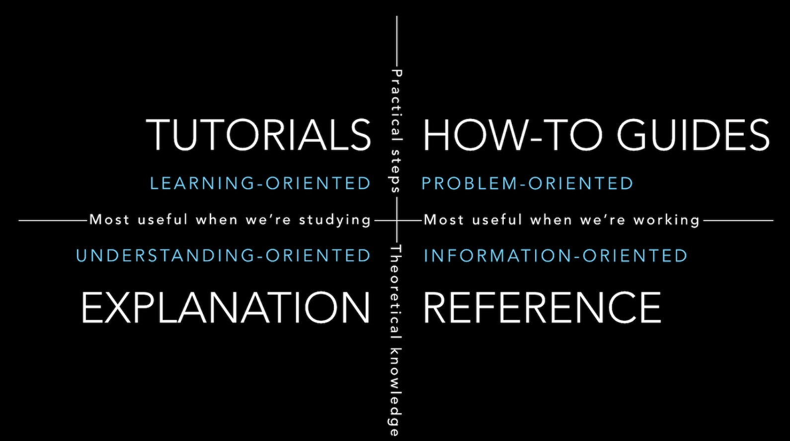

# Devops
Useful Devops tips.

## Documentation
Below is primarily taken from <https://documentation.divio.com/>, posted in [Hacker News here](https://news.ycombinator.com/item?id=26002656). All technical documentation falls under one the following four (4) groups.

1. **Tutorials**: Learning oriented
2. **How-to guides**: Problem oriented
3. **Technical reference**: Understanding oriented
4. **Explanation**: Information oriented

These 4 groups form a quadrant where each of the components is similar to its two neighbours:

- tutorials and how-to guides are *both* concerned with describing practical steps
- how-to guides and technical reference are *both* what we need when we are at work, coding
- reference guides and explanation are *both* concerned with theoretical knowledge
- tutorials and explanation are both *most* useful when we are studying, rather than actually working

Recognizing above breakdown will help add structure to your documentation.

**Other useful pointers**:
- One useful [Hacker News](https://news.ycombinator.com) discussion comment was the reference to using the "SEE" method (**S**tatement, **E**xample, **E**xplanation).
- Also, include an Introduction, Summary and a Rationale (including alternate solutions) works for a document is of essence.
- Steven Pinker's eminent point on why there is so much bad writing: **the curse of knowledge**, or knowing so much about a subject that you totally forget your readers are not as familiar.

Finally, be concise!
